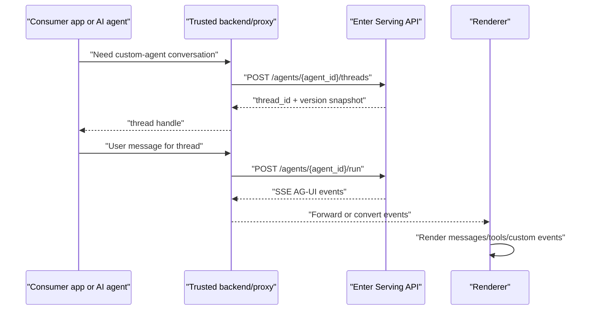

# What Is a Custom Agent

An Enter custom agent is a Builder-created agent that has been published and can be consumed through Enter's Serving APIs. The consumer does not call the Builder preview APIs directly. It creates a serving thread for a published agent version, sends user turns to `/run`, and receives AG-UI events over SSE.

## What gets integrated

A custom agent integration is not just a model call. The published agent version carries the runtime configuration that was authored in Builder:

- Agent identity: id, display name, logo, workspace ownership.
- Version snapshot: the published `agent.json` configuration used for the serving thread.
- Tool/runtime configuration: server-declared capabilities available to the agent loop.
- Model configuration: selected by the published agent version, not by the client request.
- Thread and turn records: persisted by Enter Serving so history, cancellation, resume, and metadata can work.

## Consumer responsibilities

The consuming app or AI agent owns the product experience around the custom agent:

- Decide where threads are created and stored.
- Decide whether each user gets one thread, many threads, or a project-level shared thread.
- Send user messages in the AG-UI-compatible `messages` array.
- Parse AG-UI events and turn them into the host UI state.
- Persist enough local mapping to reconnect to the same Enter serving thread.
- Keep the Enter API key outside untrusted clients.

## Two supported v1 scenarios

### Enter project integration

This route is used when the current coding task includes a system reminder injected by Enter backend. The reminder says a custom agent mention was attached and includes fields such as `id`, `api_base_url`, and `enter_api_key_secret_name`.

In this route, generate project code that adds a server-side proxy and a frontend chat/runtime. The proxy reads the Enter API key from project secrets. The browser never receives the key.

### External AI-agent consumption

This route is used when the consumer is a coding agent, backend service, script, workflow runner, or non-Enter application. The consumer may directly call Enter Serving if it runs in a trusted environment. If the consumer has a browser-facing UI, it still needs a server-side proxy.

## Glossary

- **Agent id**: Public custom-agent id, supplied by system reminder or configuration.
- **Published version**: Version selected by API-key serving. Empty create-thread body pins the latest published version.
- **Thread**: Persistent conversation/runtime context for one custom-agent conversation.
- **Turn**: One run on a thread, usually created by one user message.
- **AG-UI event**: Event object streamed over SSE. It may represent message deltas, tool activity, custom status, errors, cancellation, or metadata.
- **ThreadClient/HttpAgent**: Enter Web's frontend runtime pattern, available to projects through `@enter-pro/agent-client` and `@enter-pro/thread-client`. `HttpAgent` talks to `/run`; `ThreadClient` owns live turns, history loading, streaming flags, and subscriptions.

## Mental model

