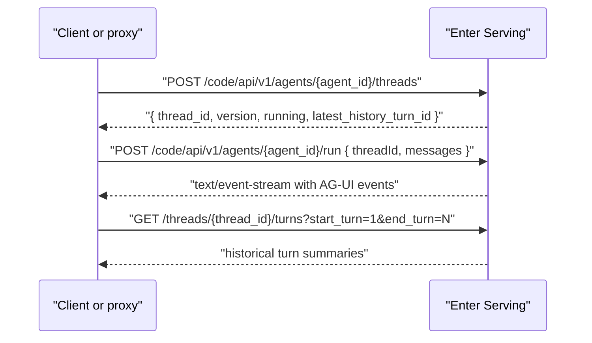

# Thread and Run Lifecycle

Every integration should be built around the serving thread. A thread pins an agent version, owns turn history, and provides the stable id needed for run, cancel, history, and resume APIs.

## Minimal lifecycle

1. Create a thread.
2. Store the returned `thread_id` with the host conversation/session/user.
3. Send the first user message to `/run` with that `threadId`.
4. Parse the SSE stream until the run reaches a terminal state.
5. Reuse the same `thread_id` for follow-up messages.



## Create thread

Endpoint:

```text
POST /code/api/v1/agents/{agent_id}/threads
Authorization: Bearer <ENTER_API_KEY>
Content-Type: application/json
```

Body:

```json
{}
```

Empty body means "create a thread for the latest published version". A JWT-authenticated Builder/debug surface can pass `{ "version": 12 }`, but API-key integrations should normally use `{}` so they stay on published serving behavior.

Business response shape:

```json
{
  "thread_id": "<THREAD_ID>",
  "agent_id": "<ENTER_CUSTOM_AGENT_ID>",
  "version": 1,
  "name": "Custom agent name",
  "agent_status": "published",
  "env_ready_at": null,
  "created_at": "2026-06-10T00:00:00Z",
  "updated_at": "2026-06-10T00:00:00Z",
  "latest_history_turn_id": 0,
  "running": null
}
```

Persist at least:

- `agent_id`
- `thread_id`
- `version`
- user/session/project owner id in the host app
- last observed turn id, if the host renders history or resumes active turns

## Run agent

Endpoint:

```text
POST /code/api/v1/agents/{agent_id}/run
Authorization: Bearer <ENTER_API_KEY>
Content-Type: application/json
Accept: text/event-stream
```

Body shape accepted by Enter Serving:

```json
{
  "threadId": "<THREAD_ID>",
  "messages": [
    {
      "id": "user-message-1",
      "role": "user",
      "content": "Hello"
    }
  ],
  "state": {},
  "context": [],
  "tools": [],
  "forwardedProps": {}
}
```

Rules from the backend:

- `threadId` is required.
- `messages` may be empty only when the caller intentionally continues/resumes prior context. For normal user turns, include one `role: "user"` message.
- If multiple user messages are passed, Serving extracts the first user message for the new turn. Do not rely on multiple user messages in one request.
- `tools` must be omitted or empty. Non-empty tools return `SERVING_TOOLS_NOT_SUPPORTED`.
- `forwardedProps.model_id` must be omitted. Model override returns `SERVING_MODEL_OVERRIDE_NOT_SUPPORTED`.
- `state` and `context` are accepted for AG-UI envelope compatibility but ignored in v1 Serving.
- `runId` is accepted in the shape but ignored in v1; do not depend on it for idempotency.

## Follow-up turns

For follow-up turns, reuse the same thread:

```json
{
  "threadId": "<THREAD_ID>",
  "messages": [
    {
      "id": "user-message-2",
      "role": "user",
      "content": "Continue with the next step"
    }
  ]
}
```

Do not create a new thread for every message unless the product explicitly wants isolated conversations.

## History loading

Use turn history when loading an existing conversation or paginating older turns:

```text
GET /code/api/v1/agents/{agent_id}/threads/{thread_id}/turns?start_turn=1&end_turn=20
```

Both `start_turn` and `end_turn` are required positive integers. The backend rejects missing or invalid values with `INVALID_TURN_RANGE`.

Enter Web maps each serving turn into AG-UI history via:

- `turn_id`
- `status`
- `model_id`
- `events`
- `degraded`
- `created_at`
- `updated_at`
- optional `user_message`
- optional `user`

Then it calls `toThreadTurnsFromAgUiHistory` from `@enter-pro/thread-client`.

## Resume active turns

If `GET /threads/{thread_id}` returns a non-null `running` turn, the frontend should resume that turn instead of starting a duplicate run.

Enter Web pattern:

1. Build `HttpAgent` with `resumeUrl` that points to `/threads/{thread_id}/turns/{turn_id}/events`.
2. Register it in `ThreadClient`.
3. Activate the client through `ThreadManager.resume(key)`.
4. If `thread.running` exists, call `agent.resumeTurn(thread.running)`.

External clients without `ThreadClient` can call the turn events endpoint directly and parse it as SSE.

## Cancel active turns

Endpoint:

```text
POST /code/api/v1/agents/{agent_id}/threads/{thread_id}/turns/{turn_id}/cancel
```

Use cancel only when the run has a known active turn id. In Enter Web, `HttpAgent.activeTurnId` is used to build the cancel URL.

Expected success shape:

```json
{
  "agent_id": "<ENTER_CUSTOM_AGENT_ID>",
  "thread_id": "<THREAD_ID>",
  "turn_id": 1,
  "status": "cancelled"
}
```

## Multiple custom agents

If the system reminder contains `custom_agents`, create a separate integration state for each agent. Do not share one `thread_id` across different `agent_id` values. A reasonable host schema is:

```text
host_conversation_id + agent_id -> thread_id
```

If the product needs orchestration among multiple custom agents, implement that as host logic that calls each agent independently and combines their outputs.

## Version behavior

- Empty create-thread body pins latest published version at creation time.
- The returned thread continues to use the version it was created with.
- API keys cannot create or run draft versions and cannot use agents from another workspace.
- Stopped versions can still have historical turns readable, but new runs/create-thread operations fail.
